<div align="center">

# Omni-Context

### 用「只给线索、不给答案」的零泄漏上下文，真实提升 Omni 模型对复杂音频的理解

**AGSC（Audio-Grounded Scaffold Context）· 三道非泄漏保险 · 五阶段全链路实验 · 三种异构 Omni 模型**

[]()
[]()
[]()
[]()
[](https://huggingface.co/datasets/AustinZhang/Omni-Context)

</div>

> **📦 双仓库开源发布**：本 GitHub 仓库包含全部代码、配置、评测清单与实验结果；数据与模型（10,000 条源音频、20,000 个上下文标注、15,433 条训练数据、16,275 条评测音频、21 个 LoRA 权重）托管在 [HuggingFace](https://huggingface.co/datasets/AustinZhang/Omni-Context)。克隆代码 + 下载数据即可完整复现。

---

> **一句话**：在多说话人重叠、环境噪声、流式输入这些真实复杂场景下，给音频大模型提供一种**零泄漏、可自动生成**的脚手架式上下文（AGSC），并用 LoRA / 强化学习把能力**内化**进模型——让「谁说了什么」（who-said-what）的 cpWER 从 **26–71 全面压到 9–15**，最难 1/3 样本绝对改善 **36–62 个百分点**，且全程经**静音探针**验证：所有增益来自「听懂音频」，而非「抄上下文里的答案」。

---

## 目录

- [1. 核心命题与一句话故事](#1-核心命题与一句话故事)
- [2. 成果速览（关键数字）](#2-成果速览关键数字)
- [3. 工作量与产出概览](#3-工作量与产出概览)
- [4. 方法：AGSC + 三道保险 + 门控 + 零泄漏合成管线](#4-方法agsc--三道保险--门控--零泄漏合成管线)
- [5. 五阶段实验链路与结果](#5-五阶段实验链路与结果)
  - [5.1 链路一 · 重叠场景](#51-链路一--重叠场景从泛化到内化)
  - [5.2 链路二 · 噪声场景](#52-链路二--噪声场景前置组件--上下文设计决定成败)
  - [5.3 链路三 · 流式场景](#53-链路三--流式场景增量增益曲线--实时门控)
  - [5.4 链路四 · 强化学习 GDPO](#54-链路四--强化学习-gdpo三阶段全链路内化)
  - [5.5 链路五 · 门控塌缩攻坚](#55-链路五--门控塌缩攻坚sft-破饱和)
- [6. 贯穿全链的五条铁律](#6-贯穿全链的五条铁律)
- [7. 仓库结构](#7-仓库结构)
- [8. 实验配置](#8-实验配置)
- [9. 环境搭建（driver 470 → cu118）](#9-环境搭建driver-470--cu118)
- [10. 一键复现](#10-一键复现)
- [11. 数据集与评测基准](#11-数据集与评测基准)
- [12. 模型权重（LoRA Checkpoints）](#12-模型权重lora-checkpoints)
- [13. 结果文件索引与图表总览](#13-结果文件索引与图表总览)
- [14. 诚实记录的负结果](#14-诚实记录的负结果)
- [15. 快速开始](#15-快速开始)
- [16. 引用与许可](#16-引用与许可)

---

## 1. 核心命题与一句话故事

Omni 模型（能同时处理音频 + 文本的大模型）在**干净、单说话人**录音上表现优异，但一旦遇到**多说话人重叠、环境噪声、远场混响**，对「谁在什么时候说了什么」的判断就急剧退化。一个自然的工程直觉是：给它一份「参考资料」（上下文）。但我们做的第一版（含答案的 XML 标注）很快撞上了**致命陷阱**：

| 模型 | 无上下文 | 加「含答案」上下文 | ⚠️ |
|---|---|---|---|
| Qwen3-Omni 30B | 65.6 | 93.3 | 分数飙高 |
| MiniCPM-o 8B | 53.4 | 96.8 | …但是 |
| Ming-flash 104B | 40.1 | 91.1 | **抄来的** |

三项诊断坐实了「抄答案」：**答案泄漏分析**（可抄率 ~100%）、**污染测试**（盲抄率 94%–99.8%）、**静音探针**（音频换成纯静音仍答对）。于是本项目的核心命题确立：

> **如何设计上下文，使模型的提升确凿来自「听懂音频」而非「抄答案」？并把它做成可泛化、可开源、可自动生成的数据合成流水线，而非依赖人工标注？**

这个命题贯穿全部五个递进阶段：**重叠 → 噪声 → 流式 → 强化学习内化 → 门控塌缩矫正**。


---

## 2. 成果速览（关键数字）

<div align="center">

| 维度 | 关键结果 |
|---|---|
| **训练内化（重叠+噪声）** | cpWER **26–71 → 9–15**；最难 1/3 样本绝对改善 **36–62 pp** |
| **内化铁证** | 训练后「不给一字线索」baseline 也大降：Qwen3 −17.7 / MiniCPM −51.8 / Ming −56.1 |
| **越弱收益越大** | Ming（−56）> MiniCPM（−52）> Qwen3（−18），三者收敛到 9–15 |
| **流式线索成熟** | 线索需 **3–6 秒成熟**，6 秒音频已拿到全量约 **80%** 增益 |
| **实时门控** | 模型自发门控 F1 **0.75–0.80**，反超外置检测器 0.53；延迟 1.72s → **0.2s** |
| **强化学习样本效率** | 仅 **160 条流**（SFT 的 1/20）即内化全链，无线索 cpWER 最高 **−64.2** |
| **推理正迁移** | 只训二元门控，独立听觉推理基准 **+10pp**，零灾难遗忘 |
| **门控塌缩矫正** | 三模型干净流门控准确率 **0 → 1.0**，转写不退化反而普遍改善 |
| **实时性开销** | 在线推理墙钟增量 **≤0.21 秒 / ≤12%**，训练内化后可零延迟部署 |

</div>

> 📌 **决定性的一张图**——训练内化（灰=训练前不给线索基线，绿=训练后同样不给线索）：
>
> 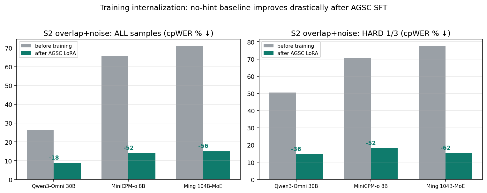

---

## 3. 工作量与产出概览

<div align="center">

| 类别 | 规模 | 说明 |
|---|---|---|
| **代码** | **74** 个 Python + **10** 个 Shell，**7,609** 行 | 合成管线 / 数据生成 / 三模型训练器 / 评测 / 流式套件 / 强化学习 / 门控矫正 / 绘图 |
| **模型** | **3** 个异构 Omni | Qwen3-Omni 30B · MiniCPM-o 8B · Ming-flash 104B-MoE |
| **训练数据** | **5** 个数据集，**15,433** 条 | 重叠 SFT 4,728 · 噪声 SFT 3,500 · S1 单人噪声 2,400 · 合成扩充 2,000 · 重叠 v1 2,805 |
| **评测基准** | **6** 任务，**16,275** wav | SparseLibriMix2 / AMI / 多说话人检测 / 说话人计数 / 性别识别 / 噪声 ASR |
| **模型权重** | **21** 个 LoRA | 3 模型 ×（重叠 / 噪声 / 门控 RL / 全链 / CSB / 门控矫正）+ Qwen3 门控中间版 |
| **实验结果** | **220** 个 JSON/JSONL + **14** 张图 | 报告中每个数字均可溯源 |
| **报告** | 6 份（综合总报告 / 论文级 / 噪声 / 流式 / RL / 总报告）| md + 楷体 docx + PDF |

</div>

**硬件约束（贯穿全程的工程挑战）**：全部在一台 **driver 470（仅支持 CUDA ≤11.4）的老卡机器** 上单机完成——所有 torch 用 cu118，DeepSpeed 需环境内单独装 CUDA 11.8 nvcc，沉淀了一整套「老硬件跑通现代多模态训练」的避坑经验。

---

## 4. 方法：AGSC + 三道保险 + 门控 + 零泄漏合成管线

### 4.1 AGSC：只给线索，不给答案

核心比喻——帮朋友在嘈杂派对里听清某人说话：

- ❌ **抄答案**：直接告诉他「那人说的是『明天三点开会』」——他根本不用听。
- ✅ **AGSC**：只告诉他「你要听的人在第 3–6 秒说话」——具体说啥，他还得竖起耳朵自己听。

针对三类场景对症给出脚手架式线索：

| 场景 | AGSC 线索 | 关键设计 |
|---|---|---|
| **重叠** | 每个说话人的**时间窗** + 性别 | 绝不含转写内容，模型必须定位后真听 |
| **S1 单人+噪声** | 噪声档位 + 语音活动区 + **部分打乱候选词** | 数字等「一抄就对」的原子答案直接不给 |
| **S2 重叠+噪声（最难）** | SepFormer 分离 → 各自 ASR → **只给部分打乱关键词** | 不给整句草稿（流畅错草稿会被照抄） |

### 4.2 三道非泄漏保险

1. **防抄契约**：提示里显式声明「线索是自动工具产生、未经验证、可能有错、不含完整答案、以音频为准」。
2. **泄漏门禁**：程序化校验——归一化后完整答案绝不允许作为线索的连续子串；候选词必须混入干扰项、打乱、残缺。
3. **静音探针**：把音频换成静音，若仅凭线索还能答对即判为泄漏——贯穿全程的「测谎仪」。

### 4.3 门控：被实证逼出来的关键设计

**线索不是越多越好**——在不需要它的地方注入会反伤。引入门控后，整体增益从「无脑全注入」的 **+1.2** 提升到 **+3.8（约 3 倍）**。门控成为后续流式、强化学习乃至门控塌缩攻坚的核心组件。

### 4.4 零泄漏自动合成管线（六阶段，免人工标注）

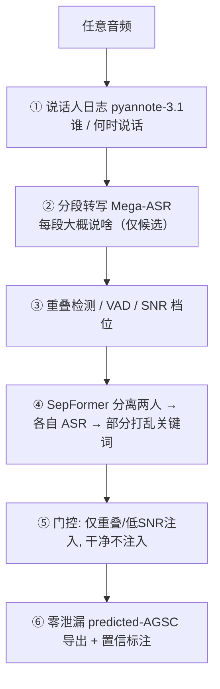

**组件实测选型（宁缺毋滥）**：

| 组件 | 选用 | 实测指标 | 选型依据 |
|---|---|---|---|
| 说话人日志 | pyannote-3.1 | DER 0.22 / 说话人数命中 75% | 完胜 CAM++（DER 0.47 / 命中 0%）|
| 分段转写 | Mega-ASR | 噪声 −5dB 下 CER 0.05 | 抗噪 SOTA |
| 语音活动检测 | silero-vad | 稳定定位语音段 | 采用 |
| SNR 估计 | VAD 能量比 | 点估 MAE ~9.9dB，粗档命中 79% | 只用粗档 |
| 声学场景标签 | AST(AudioSet) | 场景精度仅 29% | **弃用**（实证否决）|
| 语音分离 | SepFormer-whamr | 分离草稿 cpWER 16.8% | 见 §5.2 选型对比 |

---

## 5. 五阶段实验链路与结果

> **统一指标 cpWER**（concatenated permutation-invariant Word Error Rate）：把每个说话人的转写按所有可能的说话人配对方式拼接，取词错误率最低的那种配对——专为多说话人场景设计，越低越好。

### 5.1 链路一 · 重叠场景：从泛化到内化

**Stage B 推理时（训练前，零泄漏增益 Δ，越高越好）**：

| 模型 | SparseLibriMix2 Δ全部 | 难1/3 Δ | AMI 真实会议 Δ全部 | AMI 难1/3 Δ |
|---|---|---|---|---|
| Qwen3 | +1.3 | +8.3 | +12.0 | +21.8 |
| MiniCPM | +15.8 | +36.1 | +6.0 | +2.9 |
| Ming | +0.8 | +12.8 | −1.7 | +3.8 |

> **铁证**：AMI 真实会议上，baseline「过度转写」（把所有人的话一股脑转出），给了目标说话人时间窗后输出从平均 **52 词缩到 8 词**——线索零转写内容，这个改善只可能来自「用时间窗定位 + 真听」。

**Stage C 训练内化（held-out 前后，cpWER↓）**：

| 模型 | SparseLibriMix2 +AGSC 前→后 | AMI 会议 前→后 | 无线索 baseline 前→后 |
|---|---|---|---|
| Qwen3 | 25.3 → **9.0** | 69.8 → **53.3** | 26.6 → 8.4（**−16.3**）|
| MiniCPM | 48.3 → **13.8** | — | 64.1 → 14.9（**−34.5**）|
| Ming | 67.4 → **7.0** | — | 68.3 → 7.9（**−60.4**）|

### 5.2 链路二 · 噪声场景：前置组件 + 上下文设计决定成败

**整个项目最重要的方法论结论之一**：同一场景、同一模型，只换线索怎么生成、怎么措辞，结果可以从「灾难性反伤」翻转到「难样本转正」。

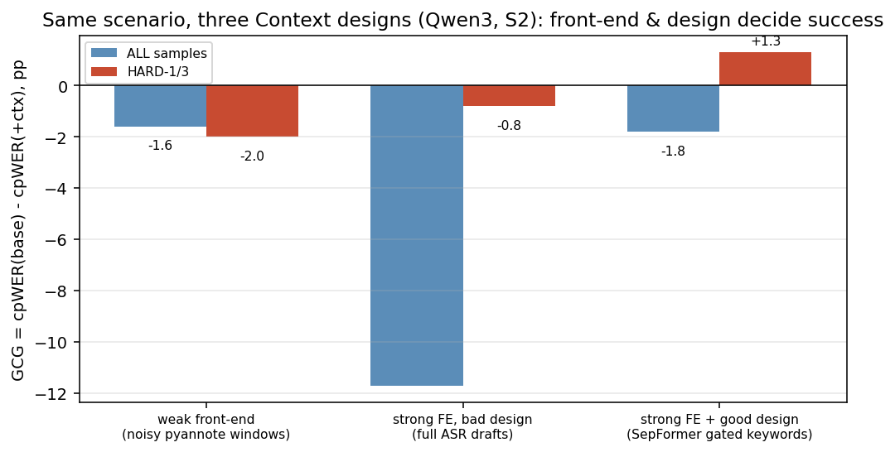

| 设计 | 全部 Δ | 难1/3 Δ | 机制 |
|---|---|---|---|
| 弱前置：带噪 pyannote 光秃时间窗 | −1.6 | −2.0 | 窗本身就错 → 误导 |
| 强前置但坏设计：ASR 整句草稿 | **−11.7** | −0.8 | 流畅错草稿被强锚定照抄 → 误差爆炸 |
| 强前置 + 好设计：SepFormer + 门控关键词 | −1.8 | **+1.3** | 既有用又不可照抄 |

**前置分离器选型（实测史诗）**：

| 前置 | 分离草稿 cpWER | 结论 |
|---|---|---|
| **SepFormer-whamr** | **16.8%** | ✅ 采用（专为 2 人 + WHAM 噪声训练）|
| SAM Audio base | 43.5% | ❌ 弃用 |
| SAM Audio small-tv | 55.8% | ❌ 弃用 |

> 通才不及专才：SAM Audio 按文字描述提取声音事件很强，但**两个同为人声的说话人分不干净**。

**Stage N-D 训练内化（held-out 前后，cpWER↓）—— 决定性结果**：


| 模型 | baseline 前→后 | +AGSC 前→后 | 难1/3 前→后 |
|---|---|---|---|
| Qwen3-Omni | 26.4 → **8.7**（−17.7）| 28.6 → **8.6**（−20.0）| 50.5 → **14.6**（−35.9）|
| MiniCPM-o | 65.8 → **14.0**（−51.8）| 62.6 → **22.5** | 70.6 → **18.1**（−52.4）|
| Ming-flash | 71.1 → **15.0**（−56.1）| 72.1 → **14.7**（−57.4）| 77.6 → **15.4**（−62.2）|

### 5.3 链路三 · 流式场景：增量增益曲线 + 实时门控

实验规模：**55 条 ≥8 秒样本 × 7 前缀长度 × 3 条件 × 3 模型 = 5,235 次推理** + 30 条合成流 × 5 门控策略 + 360 个一 token 探针窗。

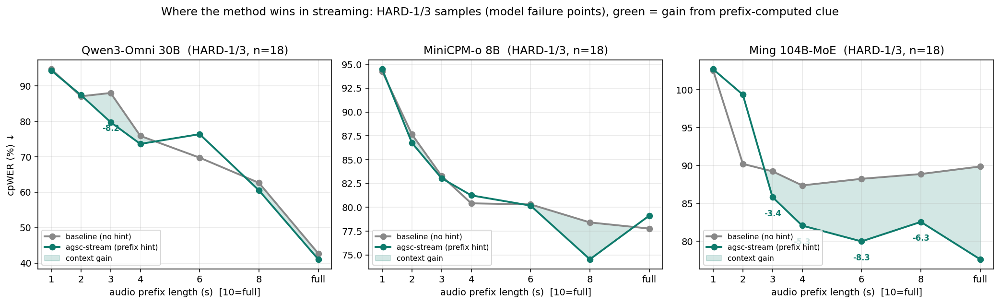

**曲线 B（线索成熟度，难 1/3 增益 pp，正=有益）**——线索需 3–6 秒成熟：

| 模型 | t1 | t2 | t3 | t4 | t6 | t8 | full |
|---|---|---|---|---|---|---|---|
| Qwen3 难1/3 | +8.8 | +6.2 | +1.2 | +2.3 | +0.2 | −0.1 | +1.9 |
| MiniCPM 难1/3 | +5.3 | +8.6 | +5.7 | +2.8 | +10.3 | +15.7 | +6.5 |
| Ming 难1/3 | +7.6 | +15.1 | +14.8 | +13.0 | +16.7 | +14.1 | **+21.2** |

**门控五策略端到端**（30 条 [clean\|complex\|clean] 流，cpWER↓）：

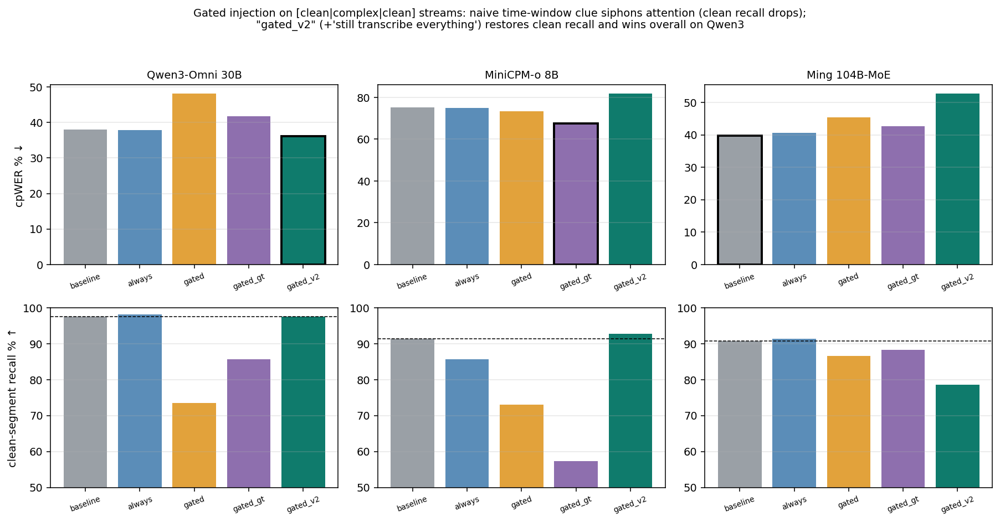

| 策略 | Qwen3 cpWER | 干净段召回 | 复杂段召回 |
|---|---|---|---|
| baseline | 38.1 | 97.6 | 40.3 |
| always（全注入）| 37.9 | 98.2 | 38.7 |
| gated（门控）| 48.2 | 73.5 | 37.2 |
| **gated_v2（门控+仍需完整转写）** | **36.2** | 97.6 | 39.5 |

> 门控可省约 **65% 注入量**；并发现并修复了「注意力虹吸」现象（门控措辞 gated_v2 对 Qwen3 是神来之笔，对 MiniCPM 却有副作用——没有万能 prompt）。

**一 token 实时门控探针**（模型自身当检测器）：

| 模型 | 2s 窗准确率 | CLEAN准确 | COMPLEX准确 | 平均延迟 |
|---|---|---|---|---|
| Qwen3-Omni 30B | 73% | 90% | 57% | 1.96s |
| MiniCPM-o 8B | 68% | 80% | 57% | **0.30s** |
| Ming 104B-MoE | 58% | 97% | 20% | 1.02s |

### 5.4 链路四 · 强化学习 GDPO：三阶段全链路内化

用一次 **GDPO**（Group reward-Decoupled Normalization Policy Optimization, arXiv:2601.05242）把「门控决策 + 重叠噪声转写 + 流式线索利用」三块能力一次性内化。

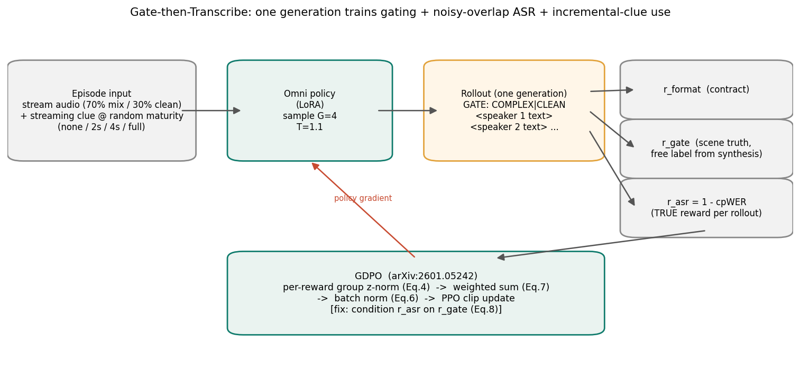

**为什么 GDPO 而非 GRPO**：多元奖励（格式 + 门控 + 转写）下，GRPO「先加总再归一」会信号塌缩、~400 步崩坏。GDPO 三机制解决：Eq.4 解耦归一化 · Eq.7 解耦权重 · Eq.6 batch 级归一 · Eq.8 条件奖励。

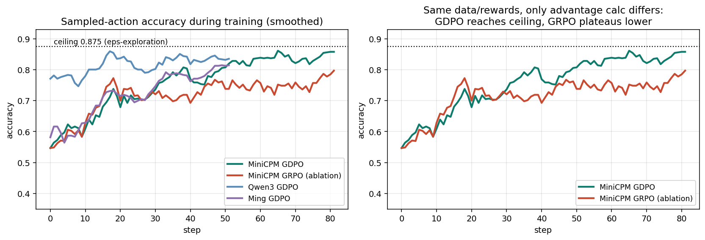

> GDPO 采样正确率 0.55 → **0.875**（ε=0.25 探索理论上限）；GRPO 卡在 0.75–0.80 平台并曾策略塌缩。

**阶段一：门控修复 + 反超外置检测器 + 推理迁移**：

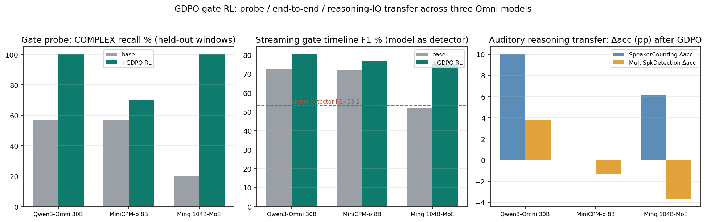

| 模型 | 探针 COMPLEX 识别 | 端到端 F1 | 触发延迟 | 听觉计数推理 |
|---|---|---|---|---|
| Qwen3 | 0.567 → **1.00** | 0.727 → **0.803** | 0.73→0.20s | 16.3% → **26.3%（+10pp）** |
| MiniCPM | 0.567 → 0.70 | 0.720 → 0.769 | 0.53→0.17s | 35.0%（零遗忘）|
| Ming | **0.20** → **1.00** | 0.522 → **0.753（+23pp）** | 1.19→0.23s | 15.0% → **21.2%** |

**阶段二：全链路 Gate-then-Transcribe 内化**（仅 160 条流 × 1–2 epoch）：

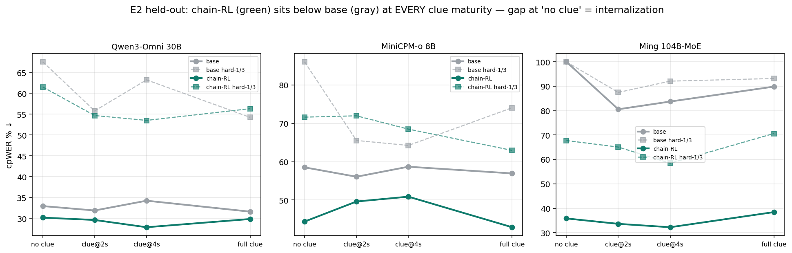

| 模型 | 无线索内化量 | 备注 |
|---|---|---|
| Qwen3 chain | −2.8 | 门控无退步（0.967–1.0）|
| MiniCPM chain | −14.1 | — |
| Ming chain | **−64.2** | E1 cpWER 97.5→35.4、干净段召回 3.3→99.4 |

> **RL 样本效率高一个数量级**：160 条流（SFT 用 3500 条）即达到同构内化效果。

**阶段三：多目标张力修复（帕累托可控）**：

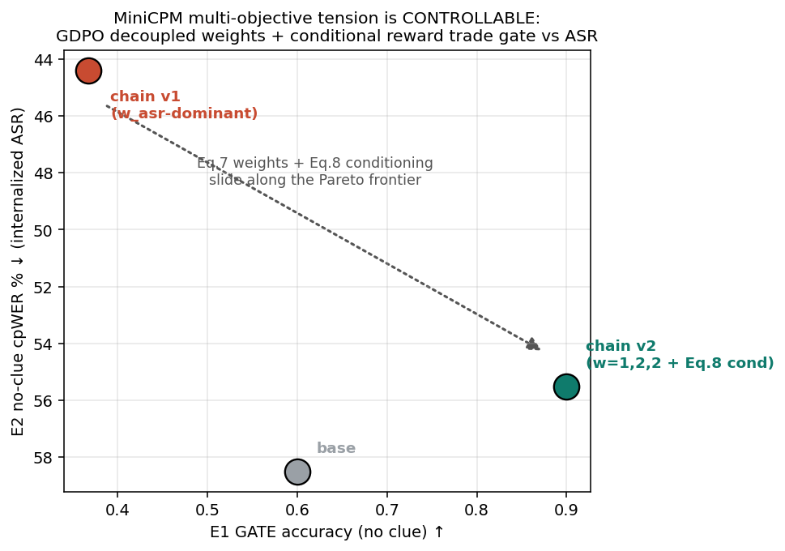

MiniCPM 的门控曾从 0.60 掉到 0.367（asr 奖励主导）。用解耦权重（Eq.7, w=1,2,2）+ 条件奖励（Eq.8）修复到 **0.90（反超 base）**，在 t4 难样本「门控+转写」双优——张力被转化为**可控的帕累托选择**。

### 5.5 链路五 · 门控塌缩攻坚：SFT 破饱和

大规模训练后，三模型干净流门控**全部塌缩成常开**（连干净录音也判「复杂」）：Qwen3/MiniCPM 干净流门控准确率掉到 **0**，Ming 仅剩 0.11。

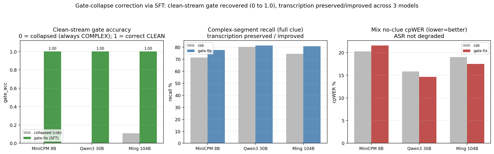

**完整攻坚链**：`forced-choice π 探针`定位概率层饱和 → 证伪软门控 → 解释 RL 为何失效（饱和点零梯度）→ **SFT 破饱和**（交叉熵 −log p(CLEAN) 在饱和点仍有大梯度）+ GATE-with-transcript 双目标解决转写截断。

| 阶段 | 干净流 π（COMPLEX 概率）| 诊断 |
|---|---|---|
| base（健康）| 0.012 | 正常 |
| csb（塌缩）| **1.000** | 常开，门控失效 |
| gatesft（矫正后）| **0.002** | 恢复健康 |

**结果**：三模型门控准确率 **0 → 1.0**，cpWER 不退化反而普遍改善（Qwen3 15.8→14.6 · MiniCPM 20.3→21.6 · Ming 19.0→17.5）。

> 💡 方法学启示：**诊断问题在哪一层，决定矫正手段**——概率层饱和的零梯度死锁，RL 推不动，必须靠 SFT 的饱和点大梯度破解。

---

## 6. 贯穿全链的五条铁律

1. **增益集中在模型真正失败处**——所有场景难 1/3 样本增益均为正，简单样本上不完美线索成噪声（这也是必须门控的根因）。
2. **训练内化是主增益**——推理时注入只是「探路」，真正价值在用训练把能力变成模型自身的本事。
3. **越弱的模型收益越大**——推理时 / SFT / RL 三个层面一致成立，Ming 全程降幅最大。
4. **前置能力 + 上下文设计精准度决定成败**——线索质量不够时不是没用，是**反伤**（−11.7 灾难、注意力虹吸）。
5. **能力可内化、可迁移**——二元门控训练顺带提升独立推理基准（+10pp），RL 调行为（160 条）vs SFT 灌容量（3500 条），分工而非替代。

> 底线：**全程零泄漏**——静音探针 + 泄漏门禁守住，所有增益是真实理解而非抄答案。

---

## 7. 仓库结构

```
Omni-Context/
├── README.md
├── LICENSE                            # Apache-2.0
├── .gitignore
│
│   ── GitHub（代码仓库）──────────────────────────────
│
├── code/                              # 全部可复现代码（74 py + 1 sh, 7609 行）
│   ├── context_synth_pipeline.py      # 零泄漏 AGSC 合成管线引擎
│   ├── bench_build_agsc*.py           # 按场景分派的 benchmark 线索构建
│   ├── noise_inject_s2.py             # WHAM 噪声注入造 S2
│   ├── gen_s1.py / gen_synth_stagec.py / gen_stage_n_train.py  # 训练集生成
│   ├── mega_gen.py / csb_build.py / csb_expand.py              # MEGA/CSB 数据集构建
│   ├── train_stage_c*.py / train_stage_n*.py                   # 三模型 SFT 训练器
│   ├── gdpo_*.py                      # GDPO 强化学习全套
│   ├── csb_gate_sft.py                # 门控塌缩矫正 SFT
│   ├── stream_*.py                    # 流式套件
│   ├── run_eval.py / run_bench_eval.py  # 评测主入口
│   ├── make_*_figs.py                 # 14 张结果图绘图脚本
│   ├── common/                        # 评测框架（data/metrics/prompts/runner/sampling）
│   └── models/                        # 三模型适配器（qwen3_omni/minicpm_o/ming + base）
├── configs/
│   └── eval_config.yaml               # 模型路径 / 评测条件 / 生成参数
├── env/                               # 环境安装与编排脚本
├── reports/                           # 9 篇实验报告（md 格式）
│
│   ── HuggingFace（数据与模型）────────────────────────
│
├── Omni-Context-DataSet/              # 源音频数据集（2.5G）
│   ├── audio/
│   │   ├── multi_speaker/             # 5,000 条多说话人重叠音频
│   │   └── speech_env/                # 5,000 条单人噪声环境音频
│   ├── contexts/                      # xml_gt + json_gt 上下文标注（20,000 文件）
│   ├── manifests/                     # 数据集 manifest（test/dev/全量）
│   ├── source_indices/                # 源音频索引
│   ├── reports/                       # 数据集统计报告
│   └── scripts/                       # 数据集构建脚本
├── benchmarks/                        # 评测基准（6.4G）
│   ├── _wav/                          # 16,275 条评测音频
│   ├── _wham/                         # WHAM 噪声源（合成用）
│   ├── _manifest/                     # 金标 manifest
│   └── _agsc/                         # 预测线索 JSONL
├── datasets/                          # 5 个训练 JSONL（15,433 条）
├── checkpoints/                       # 21 个 LoRA 权重 + SepFormer
└── results/                           # 实验结果（JSON/JSONL + 14 张图）
```

---

## 8. 实验配置

核心配置见 [`configs/eval_config.yaml`](configs/eval_config.yaml)：

| 配置项 | 值 |
|---|---|
| 评测子集 | 600 条（从 test split 分层抽样，seed=20260604）|
| 对比条件 | E0=audio_only · E1=audio+asr · E2=audio+xml_gt（诊断泄漏用）|
| 生成参数 | `max_new_tokens=512` · `do_sample=false` · `temperature=0.0`（greedy 保证可复现）|
| 模型路径 | Qwen3-Omni-30B-A3B-Instruct · MiniCPM-o-4_5 · Ming-flash-omni-2.0 |
| LoRA | 仅注意力投影，可训练参数约占全模型 **0.05%** |

**训练接口适配要点（三模型差异巨大）**：

| 模型 | 训练方式 | 关键适配 |
|---|---|---|
| Qwen3-Omni 30B | DeepSpeed ZeRO-2 四卡数据并行 | 对 thinker 模块注入 LoRA |
| MiniCPM-o 8B | 单卡 | 复刻 `model.chat` teacher-forcing 输入构造 |
| Ming-flash 104B-MoE | device_map 四卡 naive 模型并行 | 攻克 7 个自定义接口坑（模板只接受 HUMAN 轮、PEFT task_type、whisper dtype、fused-CE inplace_backward 等）|

**GDPO 强化学习超参**：`G=4`（rollout 数）· 温度采样 `T=1.1` · 解耦权重 `w=(1,2,2)` · ε-探索 `ε=0.25`（阶段一）· 条件奖励 Eq.8（`--cond_asr`）。

---

## 9. 环境搭建（driver 470 → cu118）

> ⚠️ 本机驱动 **470.199.02 仅支持 CUDA ≤11.4**，所有 torch 必须用 **cu118** 版本。这是贯穿全程的硬约束。

| conda 环境 | 用途 |
|---|---|
| `omni-context` | Qwen3 推理/训练（DeepSpeed 需环境内 CUDA 11.8 nvcc + `CUDA_HOME`）|
| `omni-context-mcpm` | MiniCPM-o |
| `ming` | Ming-flash（BailingMM2）|
| `omni-pipeline` | 合成管线（pyannote / Mega-ASR / SepFormer / silero）|
| `samaudio-venv` | SAM Audio 选型对比（已弃用，记录在案）|

```bash
# 一键搭建主环境（见 env/setup_env.sh）
bash env/setup_env.sh
bash env/install_torch231.sh    # torch 2.3.1+cu118（满足 transformers 4.57）

# 关键避坑
# 1) 装任何包一律 --no-deps，防 torch 被偷偷升级到 cu13 破坏环境
# 2) DeepSpeed 需环境内单独装 CUDA 11.8 nvcc + 设 CUDA_HOME，否则 FusedAdam 按系统 CUDA 12.8 编译
# 3) 国内镜像：conda=USTC · pip=Aliyun · github=ghfast.top · HF=hf-mirror.com
```

---

## 10. 一键复现

> **📦 前置条件**：代码已包含在本 GitHub 仓库中。运行实验前，请先从 [HuggingFace](https://huggingface.co/datasets/AustinZhang/Omni-Context) 下载数据与模型（音频 `Omni-Context-DataSet/`、训练数据 `datasets/`、评测音频 `benchmarks/_wav/` + `benchmarks/_wham/`、模型权重 `checkpoints/`），放置到项目根目录对应位置，并按 [§9 环境搭建](#9-环境搭建driver-470--cu118) 配置好 conda 环境。详见 [§15 快速开始](#15-快速开始)。

```bash
cd code

# ① 合成管线：任意音频 → 零泄漏 predicted-AGSC
python context_synth_pipeline.py --audio xxx.wav      # 重叠场景线索
python bench_build_agsc_s1.py                          # S1 噪声线索
python noise_inject_s2.py --n 150                      # 造 S2（WHAM 注噪）
python bench_build_agsc_s2sep.py                       # S2 SepFormer 门控关键词线索（零泄漏核心）

# ② 数据集生成
python gen_s1.py && python gen_synth_stagec.py && python gen_stage_n_train.py
python mega_gen.py && python csb_build.py --part merge && python csb_expand.py

# ③ 训练（噪声场景为例；Qwen3 用 DeepSpeed 四卡）
deepspeed --num_gpus 4 train_stage_n_ds.py --epochs 1 --accum 4
python train_stage_n_minicpm.py --epochs 1
python train_stage_n_ming.py --epochs 1

# ④ 评测（训练前后对比）
python run_bench_eval.py --model qwen3_omni --task SparseLibriMix2_noisy --cond agsc \
       --lora ../checkpoints/qwen3_noise_lora --tag ndft --heldout

# ⑤ 流式 / 实时性
python stream_prep.py --n 55 && python stream_eval.py --model qwen3_omni    # 增量曲线
python stream_gate_prep2.py && python stream_gate_eval.py --model qwen3_omni # 门控端到端
python stream_probe.py --model qwen3_omni                                   # 一 token 探针
python latency_bench.py --model qwen3_omni --task speech_env_S1 --n 20      # 延迟对比

# ⑥ 强化学习全链（GDPO）
python gdpo_prep_streams.py && python gdpo_prep_rewards.py --model minicpm_o
python gdpo_train_minicpm.py --algo gdpo --G 8 --epochs 3 --eps 0.25         # GDPO
python gdpo_train_minicpm.py --algo grpo --G 8 --epochs 3                    # GRPO 对照臂
python gdpo_chain_prep.py
python gdpo_chain_train.py --model minicpm_o --G 4 --temp 1.1 --weights 1.0,1.0,2.0 --cond_asr

# ⑦ 门控塌缩矫正
python csb_softgate_probe.py --model qwen3_omni --lora ../checkpoints/qwen3_csb_lora --tag probe
python csb_gate_sft.py --model qwen3_omni --resume_lora ../checkpoints/qwen3_csb_lora --clean_ratio 0.5
python csb_eval_run.py --part all --model qwen3_omni --lora ../checkpoints/qwen3_csb_lora_gatesft

# ⑧ 全部绘图
python make_summary_figs.py && python make_gdpo_figs.py && python make_chain_figs.py \
    && python make_csb_figs.py && python make_gatefix_fig.py
```

---

## 11. 数据集与评测基准

### 11.0 源音频数据集：Omni-Context-DataSet

`Omni-Context-DataSet/` 是本项目的**核心音频资产**，包含全部实验所需的源音频与上下文标注。所有训练数据（`datasets/`）和评测基准（`benchmarks/`）中引用的 `omni_v02_*` 系列音频均存储于此。

| 子目录 | 内容 | 规模 |
|---|---|---|
| `audio/multi_speaker/` | 多说话人重叠音频 | **5,000** 条 wav |
| `audio/speech_env/` | 单人 + 环境噪声音频 | **5,000** 条 wav |
| `contexts/xml_gt/` | XML 格式金标上下文标注 | **10,000** 个文件 |
| `contexts/json_gt/` | JSON 格式金标上下文标注 | **10,000** 个文件 |
| `manifests/` | 数据集划分 manifest（test / dev / 全量） | 多种 split |
| `source_indices/` | 源音频索引（溯源用） | — |
| `reports/` | 数据质量审计报告（500 条随机抽查等） | — |
| `scripts/` | 数据集构建管线脚本 | — |

**音频统计摘要**：
- 合计 **10,000 条** wav 文件，总大小约 **2.5 GB**
- 多说话人音频：2–4 人重叠混合，来源于 LibriSpeech 干净语音的合成叠加
- 噪声环境音频：单人语音叠加 WHAM/MUSAN 真实环境噪声，SNR 覆盖 −5dB 至 20dB
- 上下文标注：每条音频对应 XML（结构化时间戳 + 说话人信息）和 JSON（键值对格式）两种标注，合计 **20,000 个标注文件**

> 💡 **数据统一**：旧版 `omni_audio_context_10k_v0.2` 和 `omni_audio_context_v0.3` 已统一整合并重命名为 `Omni-Context-DataSet`，从 [HuggingFace](https://huggingface.co/datasets/AustinZhang/Omni-Context) 下载后放置到项目根目录即可。

---

**训练数据集**（`datasets/`，15,433 条）：

| 文件 | 条数 | 用途 |
|---|---|---|
| `stage_c_train_v2.jsonl` | 4,728 | 重叠场景 SFT（含 baseline + 合成扩充，751 条双音频）|
| `stage_n_train.jsonl` | 3,500 | 噪声鲁棒 SFT（真实 + 合成，掺旧重叠防遗忘）|
| `stage_c_train.jsonl` | 2,805 | 重叠场景 SFT v1 |
| `s1_train.jsonl` | 2,400 | 中文单人噪声 ASR（带未验证线索 prompt）|
| `synth_extra.jsonl` | 2,000 | 纯合成扩充集 |

**评测基准**（`benchmarks/`，16,275 wav）：

| 任务 | manifest 条数 | 底库 | 任务类型 |
|---|---|---|---|
| SparseLibriMix2 | 1,150 | LibriSpeech 稀疏重叠合成 | 双说话人分离 ASR |
| SparseLibriMix2_noisy | 150 | + WHAM 注噪 | 重叠 + 噪声 ASR（最难）|
| TargetSpeaker-ASR_AMItest | 500 | 真实会议 AMI | 目标说话人 ASR（带 enroll）|
| speech_env_S1 | 200 | 单人 + 噪声 | 噪声 ASR |
| MultiSpeakerDetection | 80 | LibriSpeech test-clean | 多说话人检测 |
| SpeakerCounting | 80 | LibriTTS test-clean | 说话人计数 |

> **真值严格区分**（开源可信度关键）：`_manifest/` 的 `label` 是确定金标；`_agsc/` 的 timeline / clue 关键词带 `provenance=predicted/unverified` 字段——数据层面就把「线索」与「答案」分开。
>
> 📦 **完整复现所需资产**：源音频数据集（`Omni-Context-DataSet/`，10,000 wav + 20,000 标注）、评测基准音频（`benchmarks/_wav/` + `_wham/`，16,275 wav）、训练数据（`datasets/`，15,433 条）、模型权重（`checkpoints/`，21 个 LoRA）托管在 [HuggingFace](https://huggingface.co/datasets/AustinZhang/Omni-Context)；全部代码（`code/`，74 py + 10 sh）、评测清单（`benchmarks/_manifest/` + `_agsc/`）和实验结果（`results/`）在本 GitHub 仓库中。

---

## 12. 模型权重（LoRA Checkpoints）

`checkpoints/` 下 21 个 LoRA，按三模型 × 阶段组织：

| 阶段 | Qwen3 | MiniCPM | Ming |
|---|---|---|---|
| 重叠 SFT | `qwen3_agsc_lora` | `minicpm_agsc_lora` | `ming_agsc_lora` |
| 噪声 SFT | `qwen3_noise_lora` | `minicpm_noise_lora` | `ming_noise_lora` |
| 门控 RL（阶段一）| `qwen3_gdpo_gate_lora` | `minicpm_gdpo_gate_lora` + `minicpm_grpo_gate_lora`(对照) | `ming_gdpo_gate_lora` |
| 全链 RL（阶段二）| `qwen3_chain_lora` | `minicpm_chain_lora` + `_v2`(Eq.8) | `ming_chain_lora` |
| CSB 大训练 | `qwen3_csb_lora` | `minicpm_csb_lora` | `ming_csb_lora` |
| **门控矫正** | `qwen3_csb_lora_gatesft` + `qwen3_csb_lora_gatefix`(中间版) | `minicpm_csb_lora_gatesft` | `ming_csb_lora_gatesft` |

上表共 **21** 个 LoRA；另加 `_sepformer`（前置分离器权重）。

---

## 13. 结果文件索引与图表总览

`results/` 下 **220 个 JSON/JSONL** 原始结果 + **14 张图**，报告中每个数字均可溯源：

| 图 | 内容 |
|---|---|
| `fig_training_internalization.png` | ⭐ 训练内化（最重要）：三模型 cpWER 训练前后 |
| `fig_s2_design_comparison.png` | S2 三种线索设计对比 |
| `fig_gate_strategies.png` | 门控五策略 |
| `fig_latency_overhead.png` | 实时性墙钟开销 |
| `stream_hard_curve.png` / `stream_hard_gain_info.png` | 流式难样本增益曲线 / 增益 vs 信息量 |
| `fig_rl_method.png` | GDPO 方法总览 |
| `fig_gdpo_training.png` | GDPO vs GRPO 训练曲线 |
| `fig_gdpo_results.png` | 三模型 GDPO 结果（门控修复+迁移）|
| `fig_chain_training.png` / `fig_chain_results.png` | 全链训练曲线 / E2 柱状 |
| `fig_rl_e2_maturity.png` | E2 四档线索成熟度 |
| `fig_rl_pareto.png` | 多目标张力帕累托 |
| `fig_gatefix.png` | 门控塌缩矫正前后 |

原始结果命名规范：`<实验>__<模型>_<条件>.json`，如 `csb_m1__csb_q3_gatesft.json`（CSB M1 评测 / Qwen3 / 门控矫正版）。汇总表见 `results/*.md`。

---

## 14. 诚实记录的负结果

一个可信的研究必须诚实记录不工作的地方——这些负结果同时界定了 AGSC 的适用边界：

- **干净 / 近天花板任务无增益空间**：S1 单人噪声（CER ~3%）、干净多说话人检测（98.8%）。
- **强模型在简单样本上线索成噪声**：Qwen3 S2 全样本净增益微负（−1.8），因简单样本被不完美线索拖累。
- **前置不可靠则有害**：AST 场景标签 29% → 弃用；带噪 pyannote 光秃窗 → −1.6；ASR 整句草稿 → **−11.7**。
- **流式超短前缀的物理边界**：1–2 秒前缀线索 0–2 词，无增益（瓶颈在前置组件需 ≥3 秒积累）。
- **门控措辞模型相关**：gated_v2 对 Qwen3 是神来之笔，对 MiniCPM 有副作用——没有万能 prompt。
- **多目标挤压在小模型上真实存在**：MiniCPM 门控 0.60→0.367，需 Eq.7/Eq.8 修复，是取舍不是免费午餐。
- **SAM Audio 不适合同类人声分离**：通才不及专才（43–56% vs SepFormer 16.8%）。
- **门控塌缩与 RL 的局限**：RL 难矫正已饱和的门控（饱和点零梯度），必须 SFT 破饱和——有价值的方法学负结果。

---

## 15. 快速开始

本项目分两部分发布：**代码**托管在 GitHub，**数据与模型**托管在 HuggingFace。

```bash
# 1. 克隆代码仓库
git clone https://github.com/zpforlove/Omni-Context.git
cd Omni-Context

# 2. 下载数据与模型（从 HuggingFace）
# 方式 A：使用 huggingface-cli
huggingface-cli download AustinZhang/Omni-Context --repo-type dataset --local-dir .

# 方式 B：使用 git-lfs
git lfs install
git clone https://huggingface.co/datasets/AustinZhang/Omni-Context .

# 3. 解压大文件
tar -xzf Omni-Context-DataSet.tar.gz
tar -xzf benchmarks_wav.tar.gz

# 4. 搭建环境（见 §9）
bash env/setup_env.sh

# 5. 运行实验（见 §10）
cd code && python run_bench_eval.py --model qwen3_omni --task SparseLibriMix2_noisy
```

> 下载后项目根目录应包含 `Omni-Context-DataSet/`、`datasets/`、`benchmarks/_wav/`、`benchmarks/_wham/`、`checkpoints/` 等数据目录。

---

## 16. 引用与许可

本项目采用 [Apache-2.0 许可证](LICENSE) 开源发布。全部资产——零泄漏 AGSC 合成管线、ContextSpeechBench 数据集与评测套件、GDPO 强化学习训练流程、三模型 LoRA 训练器——共同设计理念是「**音频优先、上下文是未验证线索而非答案、零泄漏门禁、免人工标注**」。

```bibtex
@misc{omnicontext2026,
  title  = {Omni-Context: Zero-Leakage Audio-Grounded Scaffold Context for
            Complex Speech Understanding in Omni Models},
  note   = {AGSC paradigm + GDPO reinforcement learning, verified by silence probe},
  year   = {2026}
}
```

> *所有数值均来自实测；负结果如实保留。本工作在 driver 470 老卡单机完成，全部结果可溯源。*

